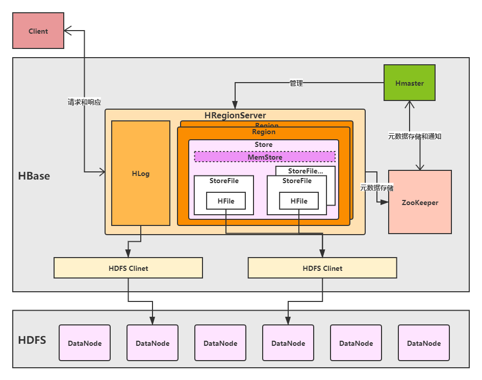

# HBase概述

**HBase**

> Apache HBase 是一个开源的、分布式的、版本化的、非关系型数据库。当您需要对大数据进行随机、实时读/写访问时，请使用 Apache HBas。该项目的目标是在商品硬件集群上托管非常大的表——数十亿行 X 数百万列。

**HBase特点**

- 海量存储

- - 适合存储PB级数据，能在几十到百毫秒内返回数据。

- 列式存储

- - 列族存储，列族管理多列。

- 极易扩展

- - 易扩展RegionServer，regionserver负责管理region和业务访问
  - 易扩展Datanode，datanode负责存储

- 高并发

- 高可用

- 稀疏

- - 列数据为空不占用空间

**架构**

**角色详解**

1. client

   - client包含访问HBase的接口，还维护了对应的cache来加速HBase的访问。比如cache的Meta元数据的信息。

2. zookeeper

3. - 通过zk实现master高可用、RegionServer的监控、元数据的入口以及集群配置的维护工作。

4. 1. 1. zk保证集群中只有1个master在运行，如果master异常，通过竞争产生新的master
      2. zk监控RegionServer状态，通知master管理RegionServer上下线。
      3. zk存储元数据的统一入口地址。

5. Hmaster

6. - 职责

7. 1. 1. 为RegionServer分配Region
      2. 维护集群的负载均衡
      3. 维护集群的元数据信息
      4. 故障转移，将失效Region分配到正常RegionServer上
      5. RegionSever失效，协调对应Hlog的拆分

8. HRegionServer

9. - RegionServer直接面向用户读写请求，是业务干活节点，功能如下：

10. 1. 1. 管理master分配的Region
       2. 处理客户端读写请求
       3. 负责和HDFS交互，存储数据到HDFS
       4. 负责Region变大后拆分
       5. 负责Storefile合并工作

11. HDSF

12. - 提供分布式数据存储服务。自带副本机制。保证高可用和高可靠。

13. Hlog

14. - 又名Write-Ahead logs

15. - HBase的写操作时，数据不是直接落盘，它会在内存中停留一段时间（时间及数据量阈值可以设置）。为了确保内存数据不丢失，数据先写入write-Ahead日志文件中，然后再写入内存。当系统故障时，可根据日志文件重建。类比mysql中binglog作用。

16. Region

17. - 可以理解为是一张表，当表数据量大成要分库分表，也就是拆分Region。

18. - Region是根据RowKey值拆分存储在不同的Regionserver中

19. Store

20. - Store对应列族

21. MemStore

22. - 内存中存储当前的操作数据

23. HFile

24. - 实际物理文件，StoreFile以HFile的格式存储在HDFS上。

