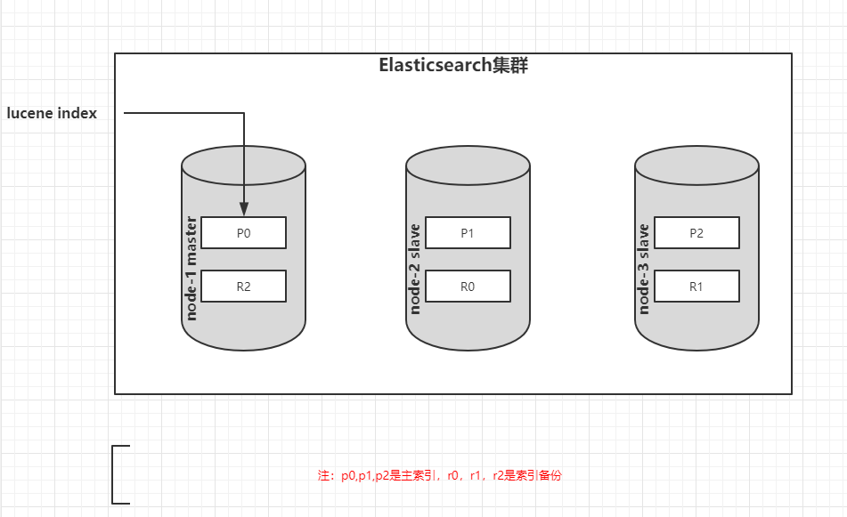
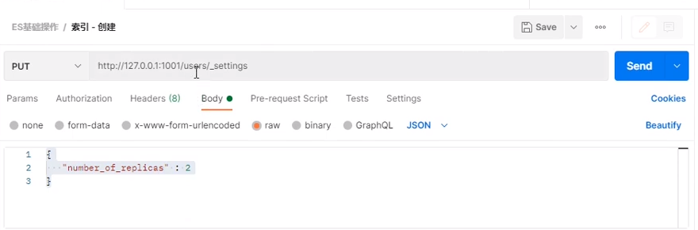
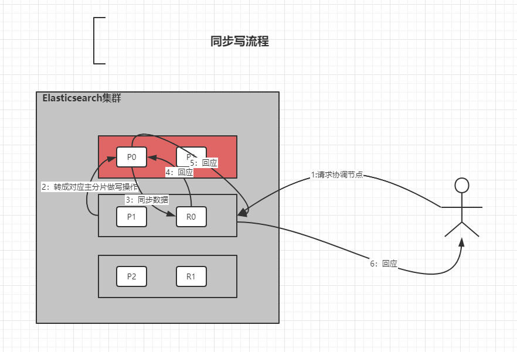
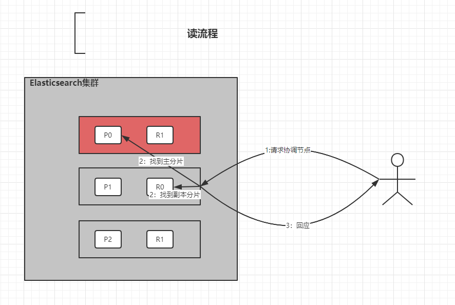
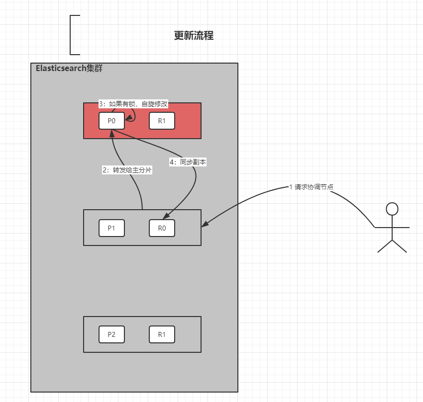

# Elasticsearch架构

**系统架构**

- 架构中索引有3个分片，每个分片1个副本

**单节点集群**

- yellow状态：主分分正常，副本分片不可用

**故障转移**

- 当集群中只有一个节点运行时，意味着会有一个单点故障问题。幸运的是，我们只需要再启动一个节点即可防止单点，确保数据安全。当你在同一台机器上启动了第二个节点时，只要它和第一个节点有同样的cluster.name，就会自动发现集群并加入其中。但是在不同机器上启动节点的时候，为了加入到同一集群，你需要配置一个可连接到的单播主机列表。之所以配置为使用单播发现，以防止节点无意中加入集群。只有在同一台机器上运行的节点才会自动组成集群。

**水平扩容**

- 主分片的数据在索引创建时就已经确定了下来。实际上，这个数目定义了这个索引能够存储的最大数据量(实际大小取于你的数据，硬件和使用场景)。但是读操作-搜索和返回数据，可以同时被主分片和副本分片处理，所以拥有越多的副本分片时，也将拥有越高的吞吐量。
- 操作改变索引副本的数量

**节点故障**

- 集群中主节点故障后，会选举出新的主节点，原主节点恢复后做为从节点服务。

**路由计算**

- 写路由

- - hash(id)%主分片数量=[0,1,2]

- 读路由:也叫分片控制

- - 用户可以访问任务一节点获取数据，这个节点称为调协节点（如果本节点繁忙，会协调到其它节点服务）。

**数据写流程**

> 通过配置参数consistency、timeout改变同步数据策略

- one：主分片写成功即响应，提升性能。
- all：全部副本写成功即响应
- quorum:默认值，大部份副本写成功即响应

**数据读流程**

流程描述

1. 客户端发送查询请示到协调节点
2. 协调节点计算数据所在的分片以及全部副本位置
3. 为了能够负载均衡，可以轮询所在节点
4. 将请求转发给具体节点
5. 节点返回查询结果，将结果反馈给客户端

**更新流程** 

> 流程描述

1. 请求协调节点。
2. 转发给主分片所在节点。
3. 节点从主分片检索文档，如果文档被另一进程修改，本次操作会重试步骤3，超过retry_on_conflict次数后放弃。
4. 如果成功更新文档，新文档同步到副本分片，重新建立索引，一担全部成功，主分片节点回应协调节点再回应客户端。

**多文档操作流程**

- 原因同更新流程

**倒排索引**

- - 索引表中的每一项都包括一个属性值和具有该属性值的各记录的地址。由于不是由记录来确定属性值，而是由属性值来确定记录的位置，因而称为倒排索引。

  - 倒排索引的建立结果是由分词器决定的。

  - 几个关键词语

  - - 词条：索引中最小存储和查询最小单元，英语是单词，汉语是词组。
    - 词典：也叫字典，是词条的集合，一般用b+tree和hashmap两种数据结构实现。
    - 倒排表：关键词的位置和频率多少。倒排表中的一行称为倒排项。

  - 倒排搜索过程

  - - 第一，在词典中搜索关键词，没有则结束
    - 第二，在倒排表中查询关键词所在文档的id

**文档搜索**

- 分段建立倒排索引
- 倒排索引不可修改
- 删除时，数据做删除标记-逻辑删除
- 搜索时，从最早的段起开始查询直到最新的段，删除的数据做过虑操作。
- 合并倒排索引时，把删除过的数据做物理删除。

# 文档分析

**分析包括以下两步**

1. 将一块文本分成适合于倒排索引的独立词条。
2. 将词条标准化格式，提高可搜索性。

**分析包括三个功能**

1. 字符过滤器

2. 1. 是分析过程第一步，字符过滤器可以过滤掉html，转化字符， 如&转and。

3. 分词器

4. 1. 拆分字符串成词条

5. token过滤器

6. 1. 改变词条：大小写转换
   2. 删除词条：删除无用词a，an，the
   3. 增强词条：jump和leap同义词

**内置分析器**

1. 标准分析器

2. 1. 根据unicode联盟定义的单词边界划分文本。删除标点，最后将词条转成小写

3. 简单分析器

4. 1. 在不是字母的地方分隔文本，将词条转成小写

   2. 1. set，the，shape，to，semi...

5. 空格分析器

6. 1. 空格的地方分隔文本

7. 语言分析器

**IK分词器**

- 中文分词器地址：https://github.com/medcl/elasticsearch-analysis-ik

