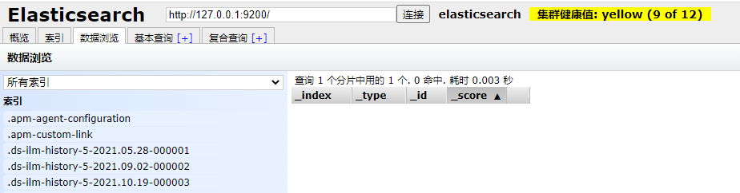

# Elasticsearch集成Kibana

### 下载Elasticsearch和Kibana

> 下载地址：https://www.elastic.co/
>
> 本集成是在window10环境下操作完成的


### 配置kibana.yml

> 在kibana的安装目录config文件夹下打开kibana.yml文件，追加如下内容
>
> ```yaml
> #默认端口
> server.port: 5601
> #es服务器地址
> elasticsearch.hosts: ["http://192.168.1.9:9200"]
> #索引名
> kibana.index: ".kibana"
> #支持中文
> i18n.locale: "zh-CN"
> ```


### 启动Elasticsearch

> window平台：bin/elasticsearch.bat
>
> linux平台: bin/elasticsearch
>
> ```shell
> elasticsearch.bat
> ```
>
> 当出现started标示时，说明启动成功.


### Elasticsearch head

> 在chrome浏览器中安装elasticsearch head插件，以便查看elasticsearch状态和数据。
>
> 


### 启动Kibana

> - bin/kibana.bat
> - http://localhost:5601/
>
> 