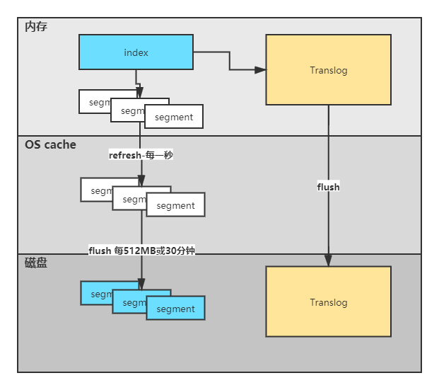

# Elasticsearch优化


**硬件的选择**

> 索引和文档最终存储在磁盘，磁盘的性能决定了IO的性能 

- 使用SSD。
- 使用RAID0。
- 使用多块硬盘，通过path.data目录配置把数据条带分配到它们上面。
- 禁止远程挂载存储，网络延迟严重。


**分片策略**

- 每个分片占用硬盘的空间不超过ES占用的JVM堆空间。比如索引500G，那分片16个左右即可。500、16=31.25G 每个分片近32G。
- 避免分片数量远大于node数量，这样可避免一个node上有多个分片，一般设置分片数不超过node数的3倍。
- 公式：主分片数*（副本数+1）>= node数。


**路由选择**

- 路由

- - 查询文档时，如何知晓存放在哪个分片中，公式：shard=hash(routing)%primary_shards_number。routing默认是文档ID，可自定义。

- 不带routing查询

- - 不带routing，查询时不知道数据在哪个分片上，查询过程分2个步骤，如下

  - - 分发：查询请求达到协调节点后，协调节点将查询请求分发到每个分片上。
    - 聚合：协调节点聚集各分片查询结果，将结果排序，给用户返回结果。

- 带routing查询，查询过程如下

- - 查询请求达到协调节点后，转至分片查询，协调节点收集数据排序，返回结果。
  - 如果routing设置是userid，直接查询出数据，效率提升很多。


 **索引落盘图**



**写入速度优化**

- es的默认配置，是综合了数据可靠性，写入速度，搜索实时性等因素。实际使用时根据需求，进行偏向性的优化。
- 针对搜索性要求不高，但是对写入要求较高的场景，我们需要尽可能的选择恰当写优化策略。综合考虑，可以从以下几方面提升写索引性能。

- 加大Translog Flush，目的是降低Iops、writeblock。
- 增加index refresh间隔，目的是减少segment merge的次数。
- 调整bulk线程池和队列。
- 优化节点间任务分布。
- 优化lucene层的索引建立，目的是降低cpu和io。


**指数据提交**

- es提供了bulk api支持批量操作，当我们有大量的写任务时，可以使用bulk来进行批量写入。
- 通用的策略如下：bulk默认设置批量提交的数据量不能超过100M。数据条数一般是根据文档的大小和服务器性能而定的，但是单次批处理的数据大小应用从5M~15M逐渐增加，当性能没有提升时，把这个数据量作为大最值。


**优化存储设备**

- ES是一种密集使用磁盘的应用，在段合并时会频繁操作磁盘，所以对磁盘要求较高，当磁盘速度提升后，集群的整体性能会大幅度提高。


**合理使用合并**

- lucene以段的形式存储数据。当有新的数据写入索引时，lucene就会自动创建一个新的段。随着数据量的变化，段的数量会越来越多，消耗多文件句柄及CPU就越多，查询效率就会下降。由于lucene段合并的计算量庞大，会消耗大量的IO，所以ES默认采用较保守的策略，让后台定期进行段合并。


**减少refresh的次数**

- lucene在新增数据时，采用了延迟写入的策略，默认情况下索引的refresh_interval为1秒。

lucene将待写入的数据先写到内存中，超过1秒时就会触发一次refresh，然后refresh会把内存中的数据刷新到操作系统的文件缓存系统中。如果我们对搜索的实效性要求不高，可以将refresh周期延长，例如30秒。这样还可以有效地减少刷新次数，但同时意味着消耗更多的heap内存。


**加大flush设置**

- flush的主要目的是把文件缓存系统中的段持久化到硬盘，当translog的数据量达到512MB或都30分钟时，会触发一次flush。
- index.translog.flush_threshold_size的参数默认是512MB，可进行修改。增加参数值意味着文件缓存系统中可能需要存储更多的数据，rnny我们需要为操作系统的文件缓存系统留下足够的空间。


**减少副本数量**

- ES为了保证集群的可用性，提供了replicas支持，然而每个副本也会执行分析、索引及可能的合并过程，所以replicas的数量会严重影响写索引的效率。当写索引时，需要写入的数据都同步到副本节点，副本节点越多，写索引的效率就越慢。如果我们需要大批量进行写入操作，可以先禁止replica复制，设置index.number_of_replicas:0关闭副本。在写入完成后，replica修改回正常的状态。


**内存设置**

- ES默认安装后设置的内存是1GB，可以这修改jvm.option文件设置内存大小。设置XMS和XMX同样大小，避免JVM垃圾回收后再计算堆区的大小。
- ES堆内存分配的两个原则

- 不要超过物理内存的50%，lucene的设计目的是把OS数据缓存到内存中。lucene的段是单个文件存储数据，这些文件都是不会变化的，所以很利于缓存，同时操作系统也会把这些段文件缓存起来，以便更快访问。如果我们设置的内存过大，lucene可用的内存将会减少，就会严重影响lucene的全文查询性能。
- 堆内存的大小最好不要超过32GB，在java中，所有对象都分配在堆上，然后有一个Klass Pointer指针指向它的类元数据。指针最大寻址32个G
- 采用31GB设置 

```properties
XMS 31g 
XMX 31g
```

